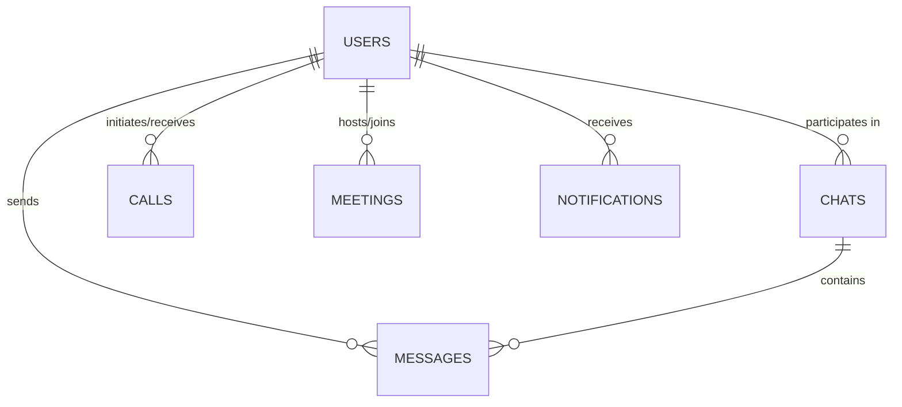

# 🗄️ Synrai — Database Design

> MongoDB collections and schema design for the Synrai platform.

---

## Overview

Synrai uses **MongoDB** as its primary database, managed through **Mongoose** ODM. The database is organized into the following collections:

| Collection      | Purpose                                  |
| --------------- | ---------------------------------------- |
| `users`         | User accounts, profiles, and settings    |
| `chats`         | Chat rooms (private and group)           |
| `messages`      | Individual messages within chats         |
| `calls`         | Voice and video call records             |
| `meetings`      | Meeting sessions and metadata            |
| `notifications` | User notifications                       |

---

## Entity-Relationship Diagram



---

## Collections

### 📋 Users

Stores user account information, profile data, and settings.

| Field       | Type       | Description                              |
| ----------- | ---------- | ---------------------------------------- |
| `_id`       | ObjectId   | Primary key (auto-generated)             |
| `username`  | String     | Unique username                          |
| `email`     | String     | Unique email address                     |
| `password`  | String     | Hashed password (bcrypt)                 |
| `avatar`    | String     | URL to profile picture                   |
| `bio`       | String     | Short user biography                     |
| `status`    | String     | Custom status message                    |
| `lastSeen`  | Date       | Timestamp of last activity               |
| `createdAt` | Date       | Account creation timestamp               |
| `updatedAt` | Date       | Last profile update timestamp            |

**Indexes:**
- `username` — Unique index
- `email` — Unique index

---

### 📋 Chats

Represents chat rooms — both private (1-on-1) and group conversations.

| Field         | Type       | Description                            |
| ------------- | ---------- | -------------------------------------- |
| `_id`         | ObjectId   | Primary key (auto-generated)           |
| `type`        | String     | Chat type: `"private"` or `"group"`    |
| `members`     | [ObjectId] | Array of user IDs participating        |
| `lastMessage` | ObjectId   | Reference to the latest message        |
| `createdAt`   | Date       | Chat creation timestamp                |
| `updatedAt`   | Date       | Last activity timestamp                |

**Indexes:**
- `members` — For fast lookup of a user's chats
- `updatedAt` — For sorting chats by recent activity

---

### 📋 Messages

Stores individual messages sent within chats.

| Field         | Type       | Description                            |
| ------------- | ---------- | -------------------------------------- |
| `_id`         | ObjectId   | Primary key (auto-generated)           |
| `chatId`      | ObjectId   | Reference to the parent chat           |
| `sender`      | ObjectId   | Reference to the sender user           |
| `message`     | String     | Text content of the message            |
| `attachments` | [Object]   | Array of attached files/media          |
| `readBy`      | [ObjectId] | Array of user IDs who have read it     |
| `reactions`   | [Object]   | Array of emoji reactions               |
| `replyTo`     | ObjectId   | Reference to the replied message       |
| `createdAt`   | Date       | Message sent timestamp                 |

**Indexes:**
- `chatId` + `createdAt` — Compound index for paginated message retrieval
- `sender` — For user message history

---

### 📋 Calls

Records voice and video call sessions.

| Field       | Type       | Description                              |
| ----------- | ---------- | ---------------------------------------- |
| `_id`       | ObjectId   | Primary key (auto-generated)             |
| `caller`    | ObjectId   | Reference to the calling user            |
| `receiver`  | ObjectId   | Reference to the receiving user          |
| `type`      | String     | Call type: `"voice"` or `"video"`        |
| `status`    | String     | Call status: `"ringing"`, `"answered"`, `"missed"`, `"declined"` |
| `startedAt` | Date       | Call start timestamp                     |
| `endedAt`   | Date       | Call end timestamp                       |
| `duration`  | Number     | Call duration in seconds                 |

**Indexes:**
- `caller` — For outgoing call history
- `receiver` — For incoming call history
- `startedAt` — For chronological sorting

---

### 📋 Meetings

Stores meeting sessions including scheduled and instant meetings.

| Field          | Type       | Description                            |
| -------------- | ---------- | -------------------------------------- |
| `_id`          | ObjectId   | Primary key (auto-generated)           |
| `meetingId`    | String     | Unique meeting identifier / join code  |
| `host`         | ObjectId   | Reference to the meeting host          |
| `participants` | [ObjectId] | Array of participant user IDs          |
| `title`        | String     | Meeting title / subject                |
| `password`     | String     | Optional meeting password              |
| `createdAt`    | Date       | Meeting creation timestamp             |
| `scheduledFor` | Date       | Scheduled start time (if scheduled)    |

**Indexes:**
- `meetingId` — Unique index for join code lookup
- `host` — For host's meeting history
- `scheduledFor` — For upcoming meeting queries

---

### 📋 Notifications

Stores user notifications for messages, calls, mentions, and meetings.

| Field       | Type       | Description                              |
| ----------- | ---------- | ---------------------------------------- |
| `_id`       | ObjectId   | Primary key (auto-generated)             |
| `userId`    | ObjectId   | Reference to the recipient user          |
| `type`      | String     | Notification type: `"message"`, `"call"`, `"mention"`, `"meeting"` |
| `message`   | String     | Notification content text                |
| `isRead`    | Boolean    | Whether the notification has been read   |
| `createdAt` | Date       | Notification creation timestamp          |

**Indexes:**
- `userId` + `isRead` — Compound index for fetching unread notifications
- `createdAt` — For chronological sorting

---

## Schema Relationships

```
Users ──┬── Chats.members[]
        ├── Messages.sender
        ├── Calls.caller / Calls.receiver
        ├── Meetings.host / Meetings.participants[]
        └── Notifications.userId

Chats ───── Messages.chatId

Messages ── Messages.replyTo (self-reference)
```

---

## Notes

- All `ObjectId` references use Mongoose `ref` for population.
- Timestamps (`createdAt`, `updatedAt`) are managed via Mongoose's `timestamps: true` option where applicable.
- Passwords are hashed using **bcrypt** before storage — never stored in plain text.
- The schema is designed to be **horizontally extensible** — new fields can be added to collections without breaking existing queries.

---

<p align="center">
  <em>See the <a href="../README.md">README</a> for project overview and roadmap.</em>
</p>
